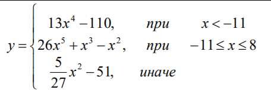

# Решение математических задач на Python

## Задание 1. first_script.py

Напишите программу – линейный алгоритм.


```python
import math

print('Введите число x.')

try:
    x = float(input())
    g = 5/3 - math.atan(math.sqrt(2 - 2 * math.cos(x) - math.e ** (-(x/5))))
    print(g)
except:
    print('Неверный формат введенных данных.')
```

## Задание 2. second_script.py



```python
print('Введите число x.')

try:
    x = float(input())
    y = 0

    if x < -11:
        y = 13 * x**4 - 110
    elif x >= -11 and x <=8:
        y = 26 * x**5 + x**3 - x**2
    else:
        y = 5 / 27 * x**2 - 51
    print(y)
except:
    print('Неверный формат введенных данных.')
```

## Задание 3. third_script.py

Написать программу с использованием оператора цикла для вычисления значений у, если х принадлежит заданному диапазону, а значения х изменяется с шагом h.

|     h    |     x    |     y    |
|----------|----------|----------|
|    1.5   |  (2,13]  |y=3x^2-x+1|

```python
for x in range(35,130,15):
    x = x/10
    y = 3 * x**2 - x + 1
    print('При x=' + str(x) + ', y=' + str(y))
```

## Задание 4. fourth_script.py

Ввести с клавиатуры строку символов. Программа должна определить длину введенной строки L, и, если длина L>10, то удаляются все цифры.

```python
print('Введите строку.')
l = input()

if len(l) > 10:
    for ch in l:
        if ch.isdigit():
            l = l.replace(ch,'')
print(l)
```

## Задание 5. fifth_script.py

Дан массив Y, содержащий 25 элементов. Записать в массив R и вывести значения элементов, вычисляемые по формуле:

, где i=1,2,…,25.

```python
from random import randrange
import math

y = [randrange(-100, 100) for i in range(25)] 

print('Исходный массив: ' + str(y))

r = []
for elem in y:
    r.append((5 * elem + math.cos(elem)**2) / 2.35)

print('Результат: ')

for elem in r:
    print("%.2f" % elem, end=" ")

```

## Задание 6. sixth_script.py

Дана матрица A(3,4).Найти количество отрицательных элементов.

```python
import random

y = []
neg = 0
for i in range(0, 3):
    li = list()
    for j in range(0, 4):
        el = random.randint(-100, 100)
        li.append(el)
        if el < 0:
            neg = neg + 1
    y.append(li)

print('Исходная матрица: ' + str(y))
print('Количество отрицательных элементов: ' + str(neg))
```